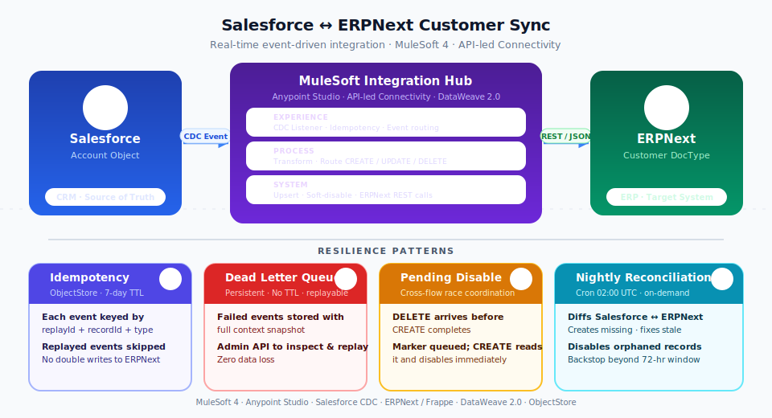

# Salesforce CDC → MuleSoft 4 → ERPNext  ·  Customer Sync

Real-time, event-driven integration that listens to Salesforce Account Change Data Capture (CDC) events and keeps ERPNext Customer records in sync — automatically, with no polling and no manual trigger required.

Built on MuleSoft 4 / Anypoint Studio with four production resilience patterns: **idempotency**, **dead letter queue (DLQ)**, **pending-disable coordination**, and **nightly reconciliation**.

---

## Architecture



### API-led layers

| Layer | Flow(s) | Responsibility |
|---|---|---|
| **Experience** | `cdc-account-event-api` | Receives CDC events from Salesforce; checks idempotency; routes by change type; writes failures to DLQ |
| **Process** | `proc-account-cdc-sync` / `proc-account-cdc-delete` | Translates CDC payload into ERP operations; delegates to system flows |
| **System** | `sys-erp-create-account` / `sys-erp-update-account` / `sys-erp-deactivate-account` | Executes ERPNext REST calls; owns all resilience logic |

---

## Four production patterns

### 1  Idempotency check

Every CDC event is keyed as `replayId_recordId_changeType` and stored in the `idempotency-store` ObjectStore (7-day TTL, persistent).  
If Salesforce replays an event you already processed, the key is already there — the event is skipped immediately, before any ERP call is made.  
The key is only written on **success**, so a mid-flight failure leaves the event replayable.

### 2  Dead Letter Queue (DLQ)

Any uncaught exception in the experience layer writes the full event context to `dlq-store` (persistent, no TTL):

- `correlationId`, `replayId`, `recordId`, `changeType`
- `errorMessage`, `errorType`, `failedAt`
- `changedFields` (JSON), `accountData` (JSON snapshot)

The event is **not** marked processed, so Salesforce's 72-hour replay window keeps it retrievable.  
Use the Admin HTTP API (port 8081) to inspect, replay, or discard entries.

### 3  Pending-disable coordination  *(DELETE before CREATE race)*

If a Salesforce DELETE CDC event arrives before the matching CREATE has finished:

- `sys-erp-deactivate-account` finds no ERP record → stores `pending_disable_{recordId} = true` in `idempotency-store` (7-day TTL)
- When CREATE completes and POSTs the new ERP record, `sys-erp-create-account` immediately checks for this marker, finds it, PUTs `{ disabled: 1 }`, and removes the marker

The account is created and disabled in the same atomic sequence — no permanently-active orphan.

### 4  Nightly reconciliation

A scheduler runs at **02:00 UTC daily** (also triggerable on-demand via `POST /api/admin/reconcile`):

1. Queries all active Salesforce Accounts
2. Queries all ERPNext Customers that have a `custom_salesforce_id`
3. Diffs the two sets:
   - **missing** in ERP → create via `sys-erp-create-account` (idempotent upsert)
   - **stale** in ERP (fields differ) → update via `sys-erp-create-account` (upsert mode)
   - **orphaned** in ERP (SF Account deleted while app was down, CDC event lost) → `PUT { disabled: 1 }`
4. Returns `{ missingCount, staleCount, orphanedCount, reconciliationId }`

This is the backstop for anything that slipped through the 72-hour Salesforce replay window.

---

## Upsert logic in detail

### `sys-erp-create-account` (used by CREATE events and reconciliation)

```
GET /Customer?filters=[["custom_salesforce_id","=","{sfId}"]]
  ├── found   → PUT /Customer/{erpName}   (update in place)
  └── not found → POST /Customer          (create new)
                    ├── success → check pending_disable marker
                    │              ├── found  → PUT {disabled:1}, remove marker
                    │              └── not found → done
                    └── 409 conflict → GET + PUT  (duplicate guard)
```

The DB UNIQUE constraint on `custom_salesforce_id` is the atomic safety net — if two threads race, only one POST wins; the other gets 409, recovers via GET+PUT, and no duplicate is created.

### `sys-erp-update-account` (UPDATE / UNDELETE events)

```
GET /Customer?filters=[["custom_salesforce_id","=","{sfId}"]]
  ├── found   → PUT only changed fields
  └── not found (UPDATE before CREATE race)
        → query full Account from Salesforce
        → re-check ERP (CREATE may have finished)
              ├── now found  → PUT (no duplicate)
              ├── still missing → POST (upsert)
              └── SF record gone → skip
```

### `sys-erp-deactivate-account` (DELETE / GAP_DELETE events)

```
GET /Customer?filters=[["custom_salesforce_id","=","{sfId}"]]
  ├── found   → PUT { disabled: 1 }
  └── not found → store pending_disable_{recordId} marker (TTL 7d)
                   (sys-erp-create-account handles it on CREATE)
```

---

## Project structure

```
salesforce-mulesoft-customer-sync/
├── src/
│   └── main/
│       ├── mule/
│       │   ├── account-cdc-sync.xml      # CDC listener, idempotency, routing,
│       │   │                             #   all three system flows, ObjectStore configs
│       │   ├── dlq-processor.xml         # Admin HTTP API (port 8081), DLQ management
│       │   └── reconciliation-job.xml    # Nightly scheduler + on-demand trigger
│       └── resources/
│           └── config.properties         # All environment configuration
├── docs/
│   └── cdc-architecture-diagram.svg
└── pom.xml
```

All three XML files are one Mule application. Run as **Mule Application** in Anypoint Studio — all flows load together.

---

## Admin HTTP API

All endpoints listen on port 8081 (`Admin_HTTP_Listener_Config`).

| Method | Path | Description |
|---|---|---|
| `GET` | `/api/admin/dlq` | List all DLQ entry keys with count |
| `GET` | `/api/admin/dlq/{key}` | Inspect a specific DLQ entry (full context) |
| `POST` | `/api/admin/dlq/{key}/replay` | Replay entry → re-runs the original flow; removes from DLQ on success, keeps on failure |
| `DELETE` | `/api/admin/dlq/{key}` | Discard a single DLQ entry without replaying |
| `DELETE` | `/api/admin/dlq` | Clear all DLQ entries |
| `POST` | `/api/admin/reconcile` | Trigger reconciliation immediately; returns summary JSON |

### Replay response

```json
{
  "message": "Replayed successfully and removed from DLQ",
  "key": "a4b1e7e8-9ead-40c5-8613-243ee732beec",
  "recordId": "001ak00002jIhQAAA0",
  "changeType": "DELETE",
  "newCorrelationId": "a4b1e7e8-9ead-40c5-8613-243ee732beec_replay_a06b7ad1-e030-4eb6-a9d5-8ec4014117bb"
}
```

---

## ERPNext prerequisites

### 1  Custom field on Customer DocType

Add a custom field to the ERPNext **Customer** DocType:

| Property | Value |
|---|---|
| Field Name | `custom_salesforce_id` |
| Field Type | `Data` |
| Label | `Salesforce ID` |
| Unique | 1 |

> The `unique: 1` flag adds a DB-level UNIQUE constraint. This is the atomic safety net that prevents duplicate ERP records if two threads race to create the same Salesforce Account.

### 2  API keys

Generate a token-based API key/secret pair for the ERPNext user that Mule will authenticate as:

- **My Settings → API Access → Generate Keys**
- Copy `api_key` and `api_secret` into `config.properties`

---

## Configuration

`src/main/resources/config.properties`:

```properties
# HTTP (Admin API)
http.host=0.0.0.0
http.port=8081

# ERPNext
erp.host=localhost
erp.port=8080
erp.apiKey=<your-api-key>
erp.apiSecret=<your-api-secret>

# Salesforce
sf.username=<your-sf-username>
sf.password=<your-sf-password>
sf.token=<your-sf-security-token>
sf.loginUrl=https://login.salesforce.com/services/Soap/u/60.0
```

For production, use Anypoint Secrets Manager or environment-specific property files instead of committing credentials.

---

## How to run

1. Open Anypoint Studio and import the project (**File → Import → Anypoint Studio Project**)
2. Verify `config.properties` has valid Salesforce and ERPNext credentials
3. Ensure ERPNext is running and reachable at `erp.host:erp.port`
4. Confirm `custom_salesforce_id` UNIQUE field exists on the ERPNext Customer DocType
5. Right-click the project → **Run As → Mule Application**

All three XML files load as a single application. The CDC listener connects to Salesforce automatically on startup and begins streaming `AccountChangeEvent` records.

---

## CDC event handling table

| Salesforce changeType | ERP operation | Resilience notes |
|---|---|---|
| `CREATE` | Upsert (GET → POST or PUT) | Pending-disable marker check after POST; 409 → GET+PUT recovery |
| `UPDATE` | GET → PUT changed fields only | Re-check ERP if not found (UPDATE before CREATE race) |
| `UNDELETE` | Same path as UPDATE | Re-enables a previously disabled ERP Customer |
| `DELETE` | GET → PUT `{ disabled: 1 }` | If not found: store pending-disable marker for when CREATE arrives |
| `GAP_DELETE` | Same path as DELETE | Emitted when SF replay window gap detected |

---

## ERPNext REST endpoints used

All calls use `Authorization: token {apiKey}:{apiSecret}`.

| Operation | Method | Path |
|---|---|---|
| Find by Salesforce ID | `GET` | `/api/resource/Customer?filters=[["custom_salesforce_id","=","{id}"]]` |
| Create | `POST` | `/api/resource/Customer` |
| Update | `PUT` | `/api/resource/Customer/{erpName}` |
| Disable (soft delete) | `PUT` | `/api/resource/Customer/{erpName}` body: `{ "disabled": 1 }` |

`erpName` is the ERPNext document's internal `name` field (e.g. `CUST-00001`), returned by GET and POST responses. It is different from the Salesforce Account ID.

---

## Resilience summary

| Threat | Defence |
|---|---|
| Salesforce replays the same event | Idempotency key in ObjectStore — duplicate skipped |
| ERP call fails (timeout, 5xx) | Error handler writes to DLQ; event stays in SF replay window |
| Two threads race to create same record | DB UNIQUE constraint → 409 → GET+PUT recovery |
| UPDATE CDC arrives before CREATE completes | Re-check ERP after querying SF; fallback POST if still missing |
| DELETE CDC arrives before CREATE completes | Pending-disable marker; CREATE reads it and disables immediately |
| App was down during SF delete (> 72h) | Nightly reconciliation finds orphaned ERP records and disables them |
| Manual fix applied directly in one system | Nightly reconciliation corrects drift |
